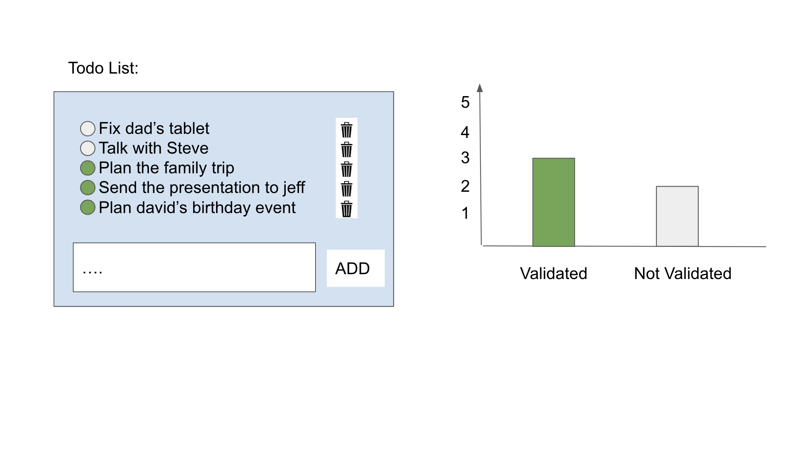

<!-- Instructions -->
## pre reqs
1. create demo account on OOTI (app.ooti.co/accounts/signup) (you will need this to get access token)

## Instructions
1) Create branch from branch:main in git
2) create new react project
4) Create a todo list component
5) Create todo chart component
7) add token input to authenticate user with OOTI Task api  (app.ooti.co/api/v1/token-auth/)
8) fetch tasks from OOTI task api (https://app.ooti.co/api/v1/docs/)
9) link actions to OOTI task api
10) add simple component test
11) style the components with your own creative touch
12) Create pull request from your branch to branch:main (include screenshot of home screen)

User stories
* User can create a task
* User can update task title
* User can mark task as completed
* User can delete a task

## Example

